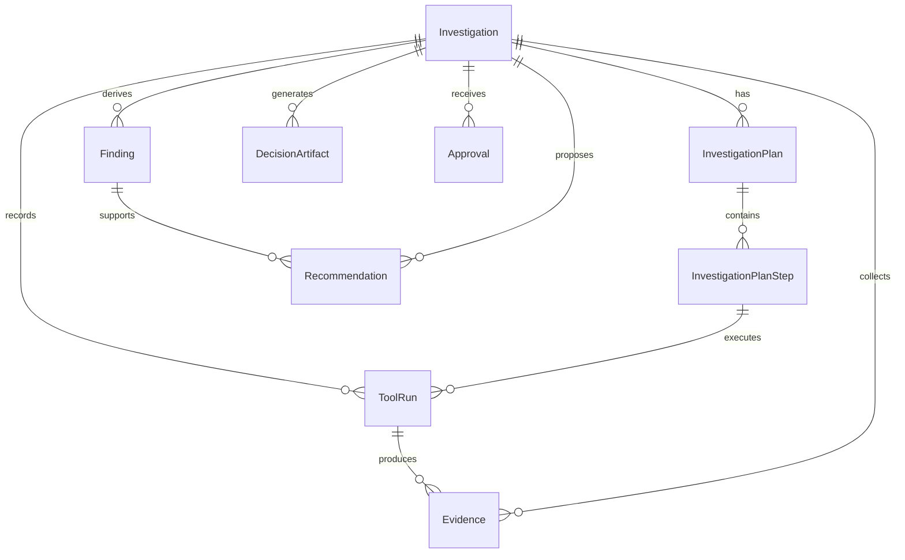

# Product Ops AI

Product Ops AI is an AI-native product operations console for live-service game
Product Managers. It turns a business objective into a traceable investigation:
planning, tool execution, evidence collection, findings, recommendations, an
executive brief, and a human approval gate.

The demo product is a fictional multiplayer game, **Project Eclipse**, with
synthetic LiveOps data covering patches, telemetry, sessions, reviews, crashes,
revenue, events, and store purchases.

## Live Demo

Deployment is not configured from this local environment yet. Add the production
frontend URL here after deployment:

- Frontend: _pending deployment_
- Backend API: _pending deployment_

## Features

- Three-state investigation console:
  - idle objective intake with example objective chips
  - live running state driven by persisted plan step and tool run records
  - complete evidence-first decision packet
- AI planner that converts a PM objective into a structured, persisted
  `InvestigationPlan`
- Provider-independent AI service layer with deterministic fallback
- Execution state machine for investigation plan steps
- Tool registry for source-data tools
- Persisted `ToolRun` and `Evidence` records for traceability
- Evidence correlation, findings, recommendations, and executive brief
- Human approval actions: approve, reject, or request deeper investigation
- Synthetic Project Eclipse LiveOps simulation seeded into PostgreSQL

## Architecture

Product Ops AI is organized around investigations, not chat messages. The
central entity is `Investigation`, with durable child records for planning,
execution, evidence, reasoning output, and approval.

```mermaid
flowchart LR
    PM["PM Objective"] --> API["FastAPI Backend"]
    API --> Planner["AI Planner"]
    Planner --> Plan["InvestigationPlan + Steps"]
    Plan --> Engine["Execution State Machine"]
    Engine --> Tools["Tool Registry"]
    Tools --> Sources["Project Eclipse Data"]
    Tools --> Evidence["Persisted Evidence"]
    Evidence --> Reasoning["AI Reasoning Services"]
    Reasoning --> Findings["Findings"]
    Findings --> Recommendations["Recommendations"]
    Recommendations --> Brief["Executive Brief"]
    Brief --> UI["Next.js Console"]
    UI --> Approval["Human Approval Gate"]
```





## Tech Stack

- Frontend: Next.js, React, TypeScript, CSS
- Backend: FastAPI, Python, SQLAlchemy
- Database: PostgreSQL
- Migrations: Alembic
- AI layer: provider-independent service with deterministic, Claude, and OpenAI
  provider abstractions
- Local infrastructure: Docker Compose
- Package management: pnpm for frontend workspace, Python virtualenv for backend

## Setup

### 1. Configure Environment

```bash
cp .env.example .env
cp backend/.env.example backend/.env
cp frontend/.env.example frontend/.env.local
```

### 2. Start PostgreSQL

```bash
docker compose up -d postgres
```

### 3. Install Backend Dependencies

```bash
cd backend
python -m venv .venv
source .venv/bin/activate
pip install -r requirements.txt
```

### 4. Run Migrations And Seed Data

```bash
cd backend
alembic upgrade head
python -m app.seed.project_eclipse
```

### 5. Start Backend

```bash
cd backend
source .venv/bin/activate
uvicorn app.main:app --reload --host 0.0.0.0 --port 8000
```

Health checks:

- `http://localhost:8000/health`
- `http://localhost:8000/health/db`

### 6. Start Frontend

```bash
cd frontend
pnpm install
pnpm dev
```

Open `http://localhost:3000`.

## Demo Workflow

1. Open the Product Ops AI console.
2. Enter an investigation objective, or select an example chip:
   - `Why are Ranked players leaving?`
   - `Evaluate Patch 1.3`
   - `Investigate declining Battle Pass revenue`
3. Start the investigation.
4. Watch the running timeline update from persisted backend plan step and tool
   run records.
5. Review the completed evidence-first packet:
   - Evidence Board
   - Findings
   - Recommendations
   - Executive Brief
   - Approval Actions
6. Expand evidence items to inspect raw tool-derived payloads.
7. Approve, reject, or request deeper investigation.

## Verification

Frontend production build:

```bash
pnpm --filter game-product-ops-ai-web build
```

Backend compile/import checks:

```bash
cd backend
.venv/bin/python -m compileall app
.venv/bin/python -c "from app.main import app; print(app.title)"
```

Database verification requires PostgreSQL to be running:

```bash
cd backend
.venv/bin/alembic current
.venv/bin/alembic upgrade head
```

## Deployment Notes

The frontend needs:

- `NEXT_PUBLIC_API_BASE_URL`

The backend needs:

- `DATABASE_URL`
- `BACKEND_CORS_ORIGINS`
- `AI_PROVIDER`
- Provider-specific API keys when real LLM providers are enabled

Use a managed PostgreSQL database for production and run Alembic migrations
before routing production traffic to the backend.
