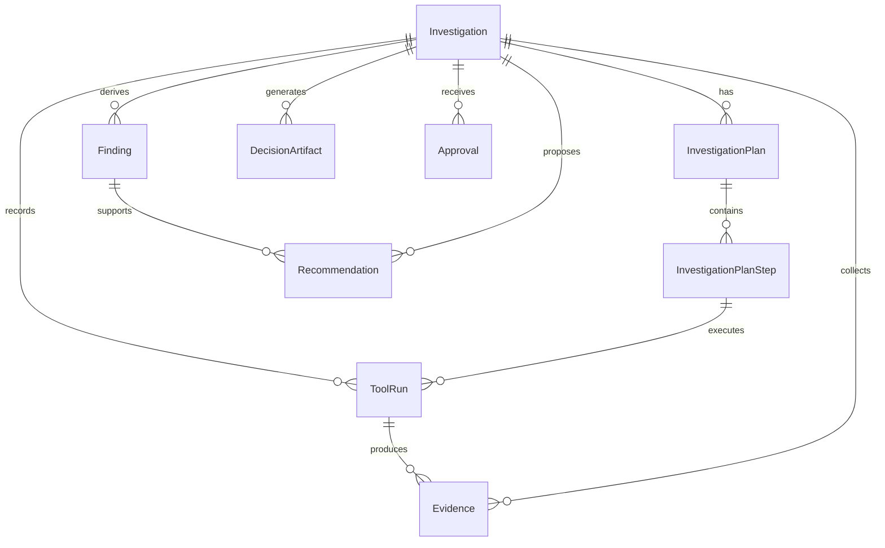

# Architecture

Product Ops AI is organized around investigations, not messages.

The central product entity is `Investigation`: a durable record of a Product
Manager's business objective and the autonomous product-ops work performed to
support a human decision.

The application is intentionally not a chatbot. The backend models the work an
AI product-ops agent performs: planning, tool usage, evidence collection,
finding generation, recommendations, decision artifacts, and approval.

## Investigation Lifecycle

```txt
Business Objective
  -> Investigation
  -> Investigation Plan
  -> Investigation Plan Steps
  -> Tool Runs
  -> Evidence
  -> Findings
  -> Recommendations
  -> Decision Artifacts
  -> Human Approval
```

Sprint 6 completes the Version 1 MVP workflow. The system can now take one PM
objective through planning, tool execution, evidence persistence, evidence
correlation, finding creation, recommendation generation, and an executive
brief. The frontend provides a minimal investigation console for running and
reviewing one complete investigation.

## Domain Entities

### Investigation

The top-level workflow object. It stores the PM objective, game context, status,
priority, requester, and lifecycle timestamps.

Why it exists:

- keeps the product objective-driven instead of message-driven
- provides one durable unit for audit, resume, comparison, and UI rendering
- anchors plans, tool runs, evidence, findings, recommendations, artifacts, and
  approvals

### InvestigationPlan

A first-class persisted plan for how the investigation should be performed.

It stores:

- objective
- objective interpretation
- hypotheses
- required data sources
- planned tool usage
- success criteria
- status
- version
- created model/version
- timestamps

Why it exists:

- preserves the AI's intended strategy
- allows investigations to be resumed after interruption
- enables audit of which sources the AI chose and why
- allows plan versions to be compared over time
- prepares the system for Sprint 4 planner output

### InvestigationPlanStep

An ordered planned action inside an investigation plan.

It stores:

- step order
- step type
- intended tool
- input scope
- selection rationale
- status
- optional linked tool runs

Why it exists:

- separates planning from execution
- gives future execution workers resumable units of work
- lets the UI visualize AI activity before, during, and after execution

### ToolRun

A durable record of an internal investigation tool invocation.

Why it exists:

- records what was queried and with which inputs
- supports retries, failures, and output summaries
- links execution back to a planned step
- remains independent of LLM providers

### Evidence

A normalized, source-backed fact collected during an investigation.

Why it exists:

- keeps evidence separate from generated prose
- supports evidence-first recommendations
- allows future tools to trace claims back to source systems

### Finding

An interpreted conclusion derived from evidence.

Why it exists:

- separates source facts from analytical conclusions
- supports confidence, severity, and root-cause reasoning
- becomes the bridge between evidence and recommendations

### Recommendation

A proposed action backed by findings and evidence.

Why it exists:

- ensures actions are reviewable and evidence-backed
- supports priority, confidence, risk, and approval status
- preserves the rule that AI recommends but the PM decides

### DecisionArtifact

A durable PM-facing artifact such as an executive brief, root cause analysis,
evidence board, prioritized issues, suggested A/B tests, or risk assessment.

Why it exists:

- stores decision-ready output independently of transient UI state
- allows artifacts to be versioned and reviewed later

### Approval

A human decision record for an investigation.

Why it exists:

- enforces human approval
- records approved and rejected recommendations
- supports follow-up requests without letting the AI silently act

## Relationship Diagram



## Planning And Execution Boundary

Planning is persisted before execution.

The planner creates an `InvestigationPlan` and ordered
`InvestigationPlanStep` records. A future execution engine should then execute
steps and attach `ToolRun` records. Evidence, findings, recommendations, and
artifacts should be derived only after tool runs provide source-backed data.

This boundary is important because it makes the AI's work:

- auditable
- resumable
- comparable
- inspectable by the PM
- safe to evolve into multi-step orchestration later

## Planner

The planner is provider-independent and depends on a structured LLM abstraction.
Its only responsibility is to create valid, persisted planning records.

For each objective it should:

- interpret the business objective
- identify the affected product domain
- generate candidate hypotheses
- determine evidence needed to validate each hypothesis
- select the minimum required tools
- create ordered plan steps
- define success criteria
- provide a rationale for every planned step
- persist the plan and steps

The planner must not:

- execute investigations
- invoke tools
- collect evidence
- correlate evidence
- generate findings
- generate recommendations
- generate decision artifacts

This keeps planning inspectable and resumable while preserving the execution
boundary needed for future orchestration.

## Provider Independence

The domain tables do not reference a specific LLM provider. `created_model` and
`created_model_version` are descriptive provenance fields only. They do not
couple the product model to OpenAI, Anthropic, local models, or any orchestration
framework.

This keeps the product architecture focused on product operations workflows
rather than vendor-specific AI APIs.

The `StructuredLLM` abstraction allows the planner to use a remote LLM, local
model, or deterministic development model without changing planner persistence
or domain entities.

## Execution State Machine

The Sprint 5 executor is a small state machine with a deliberately narrow
responsibility:

```txt
planned
  -> executing
  -> evidence_collected
```

Failure path:

```txt
planned
  -> executing
  -> execution_failed
```

For each planned step with an `intended_tool`, the executor:

- creates a `ToolRun`
- invokes the matching tool from the `ToolRegistry`
- stores the tool output summary on the `ToolRun`
- converts returned source facts into `Evidence`
- marks the step completed or failed

The executor skips non-tool planning steps, such as objective interpretation and
cross-source validation placeholders. Those steps remain planning context until
future analysis stages exist.

## Tool Registry

The `ToolRegistry` maps stable tool names from planning output to internal
read-only source-data tools. Sprint 5 tools query the synthetic Project Eclipse
database only.

Registered tools:

- `readPatchNotes`
- `getLiveOpsEvents`
- `getSessionAnalytics`
- `getTelemetry`
- `searchReviews`
- `getCrashMetrics`
- `getRevenueMetrics`
- `getStorePurchases`

Tools return structured evidence candidates. They do not create findings,
recommendations, artifacts, approvals, or external side effects.

## Evidence Correlation

After evidence collection, the MVP correlator groups persisted evidence into
product themes such as ranked matchmaking friction, stability regression,
monetization shift, LiveOps context, release context, and product health
signals.

The correlator does not call tools. It only reads persisted evidence and creates
intermediate correlation groups used by the finding service.

## Findings

The finding service converts correlated evidence groups into persisted
`Finding` records. Findings are analytical conclusions, not actions. Each
finding stores confidence, severity, and supporting evidence ids.

## Recommendations

The recommendation engine converts findings into proposed actions. Every
recommendation remains evidence-backed through the finding's supporting evidence
ids and requires human approval.

The engine does not apply product changes.

## Executive Brief

The executive brief generator creates a `DecisionArtifact` with:

- objective
- objective interpretation
- product domain
- summary
- top findings
- proposed recommendations
- approval requirement

This gives the PM a decision-ready artifact while preserving the human approval
boundary.

## Minimal MVP UI

The frontend exposes a small investigation console:

- objective input
- suggested objectives
- run investigation action
- workflow counts
- executive brief
- findings
- recommendations

The UI is intentionally minimal. It visualizes the completed workflow without
adding unrelated dashboard or chat features.
